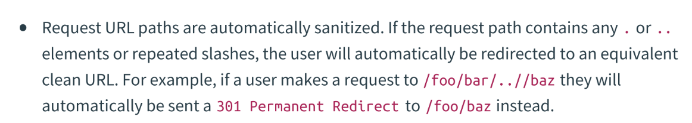
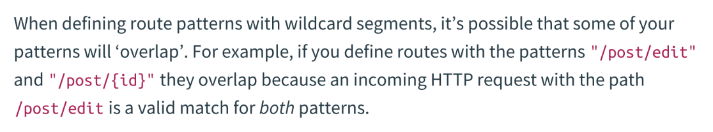

## Building GistBook 
I am currently trying to focus on understanding and writing go by building a go API from scratch. I am using the book "Let's Go" for assistance. I will try to make and break the application throughout to strengthen my overall understanding. 

### Routes

- The http.Handle() and http.HandleFunc() use default servemux under the hood. 
If http.ListenAndServer is passed with nil as the second argument, it will default to using the global default serveMux. 

- If paths overlap, go's servemux decides the precedence. 
Go defines specificity very clearly. A path which maps to a specific URL is more specific than one whichh maps to multiple URLs. 

It is generally a good practice to avoid overlapping URLs in an application. 

